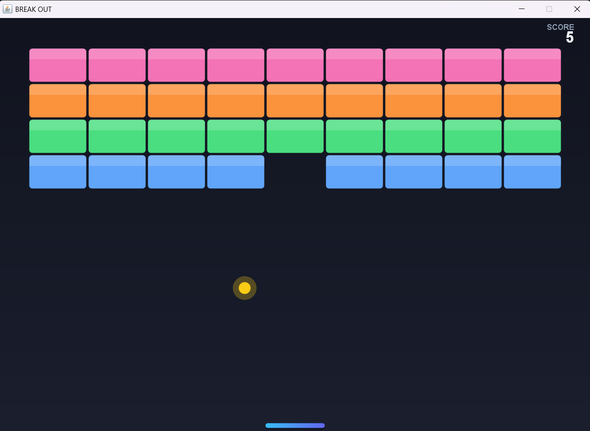
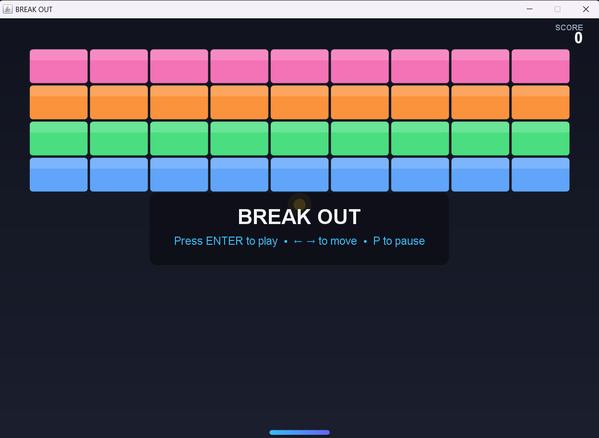
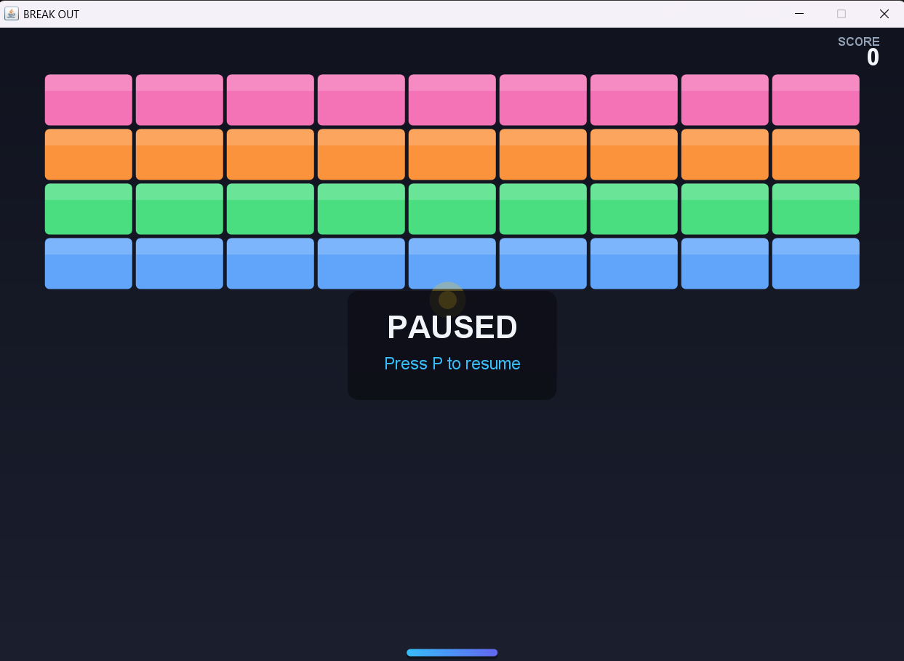
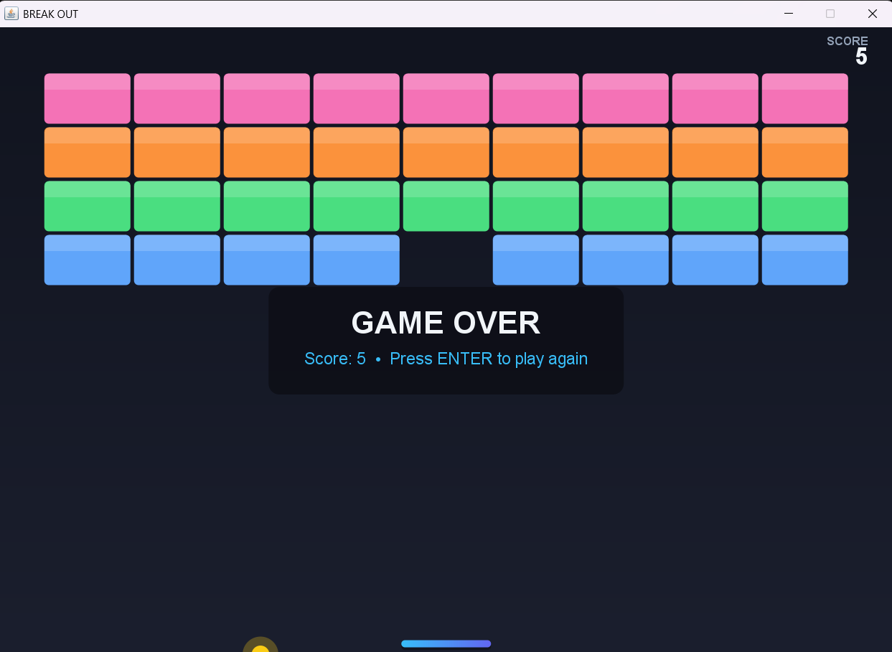
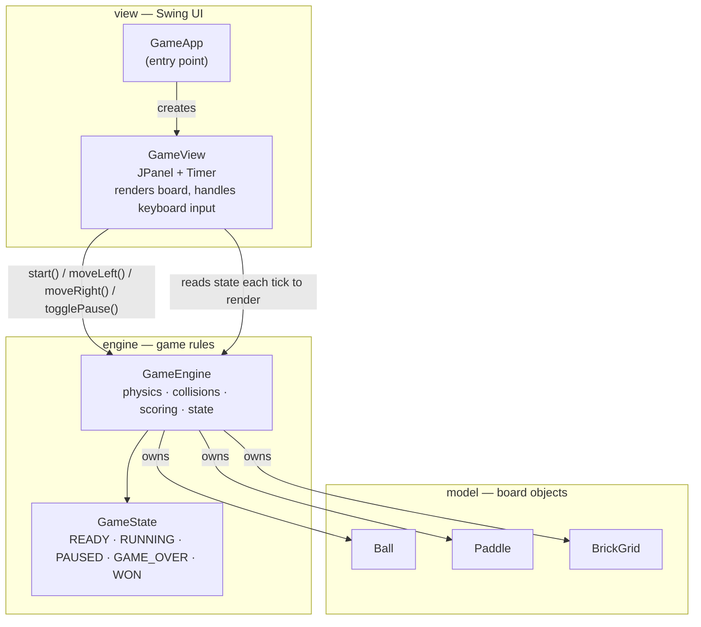
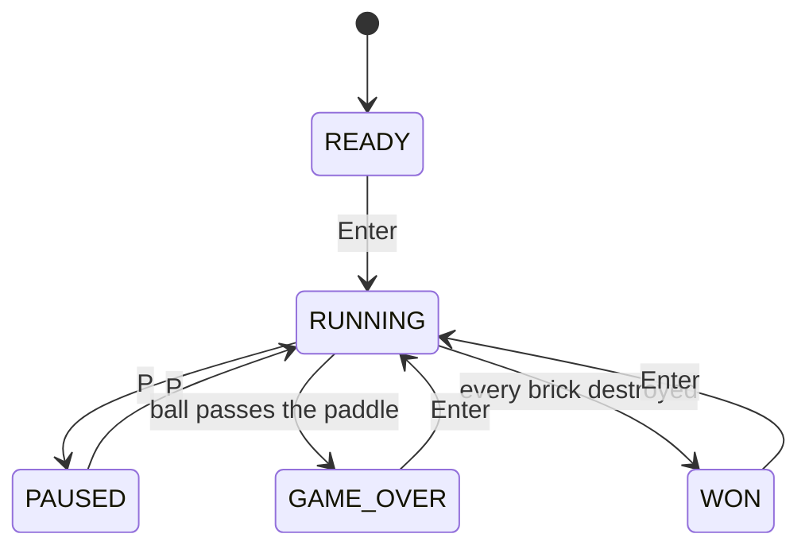

# Break Out

A modern Java Swing remake of Atari's 1976 Breakout arcade game — rebuilt with a clean
layered architecture, a minimalist dark UI, and a full unit test suite.

[](https://github.com/Hqasim/Break-Out/actions/workflows/ci.yml)


[](LICENSE)



## Features

- Classic Breakout gameplay: paddle, ball, four rows of bricks, six hand-tuned rebound angles
- **Pause / resume** with `P`, mid-game, without losing your position
- Minimalist, modern dark UI — gradient backdrop, glowing ball, rounded gloss-highlighted
  bricks, gradient paddle, dynamic centered overlays for every game state
- Clean layered architecture (`model` / `engine` / `view`) with the physics fully decoupled
  from Swing, so the core game logic is unit tested with zero UI dependency
- 33 JUnit 5 tests covering movement, collisions, scoring, pause, win/loss and rebound angles
- Builds and runs from the terminal with the bundled Maven Wrapper — no IDE required

## Screenshots

| Start | Playing | Paused | Game Over |
|---|---|---|---|
|  |  |  |  |

## Controls

| Key | Action |
|---|---|
| `Enter` | Start a new game / restart after game over or a win |
| `←` / `→` | Move the paddle |
| `P` | Pause / resume |

## Architecture

The game is split into three layers with a strict one-way dependency: **view** depends on
**engine**, **engine** depends on **model**, and neither `engine` nor `model` know Swing
exists. That's what makes the game's rules testable without spinning up a display.



`GameEngine.update()` runs once per timer tick and is the only place physics happens:
move the ball, resolve wall/paddle/brick collisions, then check win/loss conditions.



### Project structure

```
src/
├── main/java/hamzahqasim/breakout/
│   ├── GameApp.java          # entry point: builds the JFrame
│   ├── model/                # Ball, Paddle, BrickGrid — plain, Swing-free
│   ├── engine/                # GameEngine, GameState — pure game logic
│   └── view/                  # GameView (JPanel), Theme — rendering & input
└── test/java/hamzahqasim/breakout/
    ├── model/                 # BallTest, PaddleTest, BrickGridTest
    └── engine/                 # GameEngineTest
```

## Getting started

**Requirements:** JDK 27+. No Maven install needed — the repo ships the Maven Wrapper.

```bash
git clone https://github.com/Hqasim/Break-Out.git
cd Break-Out
```

Run directly:

```bash
./mvnw compile exec:java      # Linux/macOS/Git Bash
.\mvnw.cmd compile exec:java  # Windows PowerShell
```

Or build a runnable jar:

```bash
./mvnw package
java -jar target/break-out.jar
```

## Testing

```bash
./mvnw test
```

33 tests across `model` and `engine` cover ball movement and direction normalization, paddle
clamping, brick destruction and win detection, wall/paddle/brick collision resolution, the six
paddle rebound zones, scoring, and pause behavior — all without touching Swing.

## Versioning

**Version 3.0** — Ground-up rewrite:
- Restructured into a testable `model` / `engine` / `view` architecture, migrated to Maven
- Added pause/resume (`P`)
- Redesigned visuals: dark gradient theme, glowing ball, gloss-highlighted rounded bricks,
  gradient paddle, dynamic centered overlays
- Added a 33-test JUnit 5 suite and full Javadoc coverage
- Fixed a bug where pressing Enter did not start the game (the game panel never received
  keyboard focus)
- Removed JetBrains IDE project files and checked-in build artifacts in favor of the Maven
  Wrapper

**Version 2.0** — Added new brick colors, per-collision rebound angles, start screen text.

## License

[MIT](LICENSE)

## Author

**Hamzah Qasim**
